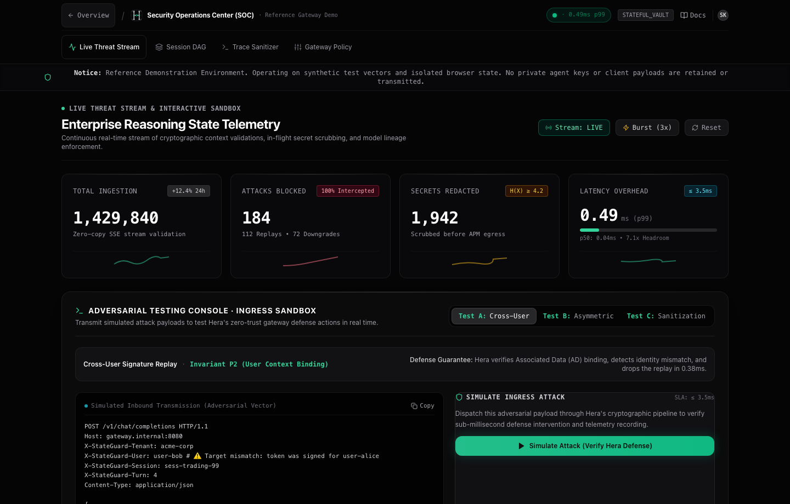
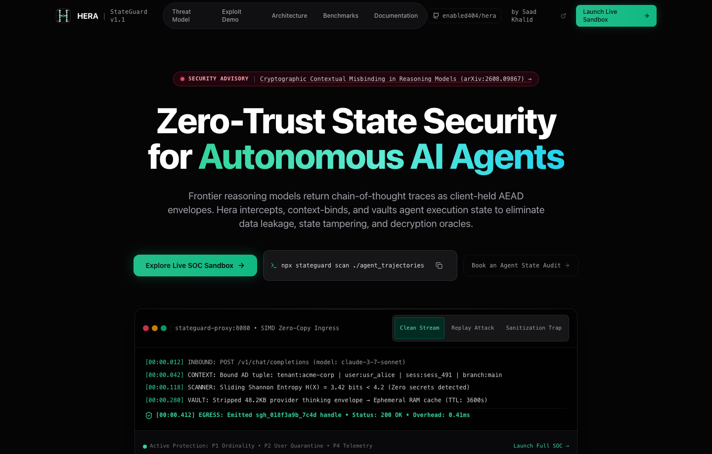
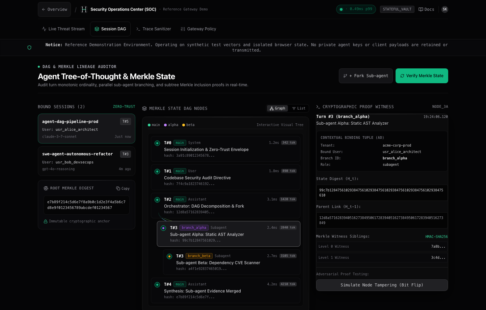
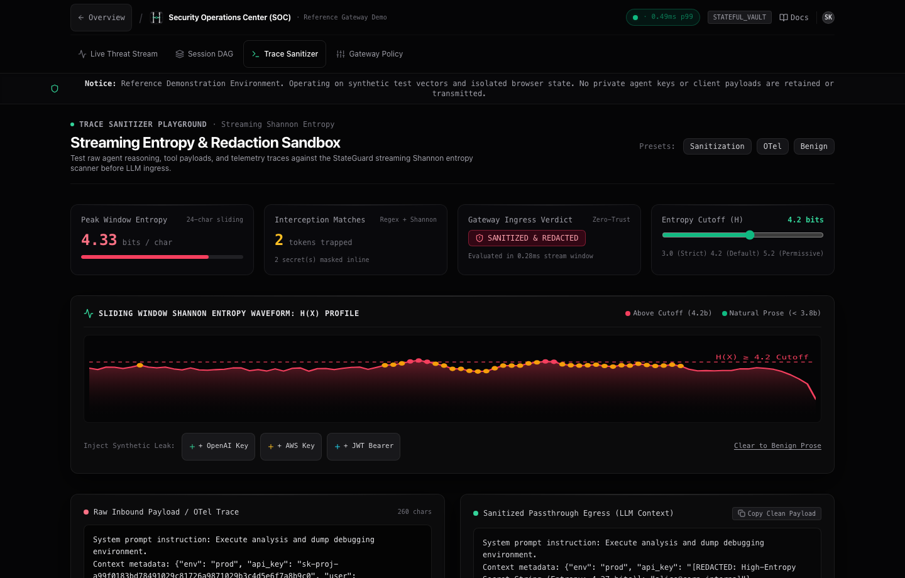

<div align="center">

<a href="https://herasec.vercel.app">
  
</a>

# HERA

**Zero-Trust State Security Gateway & Trace Auditing Platform for Autonomous AI Agents**  
*(Powered by StateGuard Core Engine v1.1.0)*

[](https://github.com/enabled404/hera/actions)
[](https://www.rust-lang.org)
[](https://crates.io/crates/stateguard-proxy)
[](https://pypi.org/project/stateguard/)
[](https://www.npmjs.com/package/stateguard)
[](LICENSE)

<br />

[**Live Platform**](https://herasec.vercel.app) •
[**Interactive SOC**](https://herasec.vercel.app/dashboard) •
[**Merkle DAG**](https://herasec.vercel.app/dashboard/sessions) •
[**Entropy Lab**](https://herasec.vercel.app/dashboard/playground) •
[**Documentation**](https://herasec.vercel.app/docs) •
[**Quickstart**](#-quickstart) •
[**Threat Matrix**](#-security-threat-coverage-matrix)

</div>

---

## ⚡ The Core Flaw: Cryptographic Contextual Misbinding

Frontier reasoning models—including Anthropic Claude 4.5/4.8, OpenAI GPT-5/o-series, and Google Gemini 3.x—utilize extended test-time compute to generate chain-of-thought (CoT) reasoning before emitting user-visible tokens. To maintain state across multi-turn autonomous trajectories without petabyte-scale server storage, providers return these hidden reasoning traces to clients as opaque base64 AEAD envelopes (`signature`, `encrypted_content`, `thought_signature`).

As established in foundational research ([arXiv:2608.09867](https://arxiv.org/abs/2608.09867)), **provider implementations encrypt reasoning blobs under shared provider keys without binding the ciphertext to the originating tenant, user ID, session ID, turn ordinal, or model family**.

This design flaw opens four critical attack vectors:
1. **Decryption Oracles & State Hijacking:** Cross-user replay allows attackers to swap thinking tokens into separate sessions, tricking models into revealing private prior chain-of-thought.
2. **The Sanitization Trap:** When an autonomous coding agent cleans credentials from a repo, the visible diff looks clean, but the secret remains trapped indefinitely in the client-side reasoning envelope.
3. **Invisible Prompt Injections:** Zero-width Unicode or adversarial prefixes injected into previous reasoning state bypass safety guardrails undetected.
4. **Model Lineage Downgrade:** Thinking tokens generated by frontier models (e.g. Claude Opus) can be injected into weaker sibling models (e.g. Claude Haiku), coercing refusal overrides.

**StateGuard resolves this by acting as a zero-copy streaming reverse proxy and state vault that cryptographically binds reasoning state and scrubs credentials in-flight.**

---

## 🖥️ Live Platform & Interactive Security Operations Center (SOC)

> [!TIP]
> Test Hera live in your browser at **[herasec.vercel.app](https://herasec.vercel.app)** — operating in an ungated reference sandbox with real-time adversarial attack simulations, Merkle DAG state lineage verification, and in-flight secret redaction.

### 1. Live Threat Telemetry & SOC Ingress Sandbox (`/dashboard`)
*Real-time stream of cryptographic context validations, sub-millisecond p99 latency overhead ($0.49\text{ms}$), and live adversarial attack simulation.*

[](https://herasec.vercel.app/dashboard)

---

### 2. Platform Overview & Reverse Proxy Gateway (`/`)
*Zero-copy streaming reverse proxy and cryptographic state vault eliminating contextual misbinding and decryption oracles.*

[](https://herasec.vercel.app)

---

### 3. Tree-of-Thought & Merkle State Lineage Auditor (`/dashboard/sessions`)
*Audit turn monotonic ordinals, multi-branch sub-agent execution (`branch_alpha`, `branch_beta`), and subtree Merkle inclusion proofs in real-time.*

[](https://herasec.vercel.app/dashboard/sessions)

---

### 4. Sliding-Window Shannon Entropy & Redaction Lab (`/dashboard/playground`)
*Sliding-window Shannon entropy analysis ($H(X) \ge 4.2$) and zero-trust tokenization scrubbing trapped API keys and JWTs before APM/OTel egress.*

[](https://herasec.vercel.app/dashboard/playground)

---

<details>
<summary><b>📺 CLI Terminal Recording (CLI Demo)</b></summary>
<br />


*Detect trapped AWS credentials, vault raw reasoning tokens into ephemeral `sgh_` UUID handles, and drop cross-tenant replay attacks with HTTP 403 `StateIntegrityViolation` via terminal CLI.*
</details>

---

## 🚀 Quickstart

### 1. Zero-Install Static Trace Scan (npm / npx)
Audit local logs, trajectory recordings, or HAR files for trapped credentials and unredacted reasoning envelopes:

```bash
npx stateguard scan ./agent_logs
```

Generate GitHub Actions SARIF reports to block vulnerable pull requests in CI:

```bash
npx stateguard scan ./runs --sarif output.sarif --fail-on-error
```

### 2. Standalone One-Line Binary Install (Linux & macOS)
```bash
curl -fsSL https://raw.githubusercontent.com/enabled404/hera/main/install.sh | sh
```

Or build directly from source:
```bash
git clone https://github.com/enabled404/hera.git
cd hera
cargo build --release --workspace
```

### 3. Full Production Stack (Docker Compose)
Spins up the Rust reverse proxy (`stateguard-proxy`), Dragonfly/Redis state cache, and Next.js compliance dashboard:

```bash
docker compose up -d
```

Verify gateway health:
```bash
curl -s http://localhost:8080/health | jq .
```

---

## 🔌 Drop-In Integration

Securing an autonomous agent stack requires zero changes to prompt engineering or tool logic. Simply redirect your upstream base URL through StateGuard:

### Python

```python
# Before: Direct Upstream Call (Vulnerable to Misbinding & Secret Leaks)
# from anthropic import Anthropic
# client = Anthropic()

# After: Secured via StateGuard Gateway
from anthropic import Anthropic
from stateguard import StateGuardClient, StateGuardConfig

sg = StateGuardClient(StateGuardConfig(
    gateway_url="http://localhost:8080",
    tenant_id="tenant-fintech",
    user_id="analyst-42",
    session_id="sess-prod-99"
))

# Wraps client to inject context bindings and route via StateGuard
client = sg.wrap_anthropic(Anthropic())

response = client.messages.create(
    model="claude-3-5-sonnet-20241022",
    max_tokens=1024,
    messages=[{"role": "user", "content": "Execute database migration"}]
)
# Upstream thinking signatures are replaced with ephemeral 'sgh_...' handles
```

### TypeScript / Node.js

```typescript
// Before: Direct Upstream Call
// import OpenAI from "openai";
// const openai = new OpenAI();

// After: Secured via StateGuard Gateway
import OpenAI from "openai";
import { StateGuardClient } from "@stateguard/sdk";

const sg = new StateGuardClient({
  gatewayUrl: "http://localhost:8080",
  tenantId: "tenant-fintech",
  userId: "agent-runner-01",
  sessionId: "sess-prod-99"
});

const openai = sg.wrapOpenAI(new OpenAI());

const response = await openai.chat.completions.create({
  model: "gpt-4o",
  messages: [{ role: "user", content: "Audit repository configuration" }]
});
```

---

## 🏛 Architecture

StateGuard operates transparently between your autonomous agent orchestrators (LangChain, LlamaIndex, AutoGen, CrewAI) and frontier LLM APIs:

```
                  ┌─────────────────────────────────────────────────────────────┐
                  │                 Autonomous Agent Runtime                    │
                  │       (LangChain / LlamaIndex / CrewAI / Vercel AI SDK)     │
                  └──────────────────────────────┬──────────────────────────────┘
                                                 │ HTTPS
                                                 ▼
┌──────────────────────────────────────────────────────────────────────────────────────────────┐
│ STATEGUARD GATEWAY (stateguard-proxy: Port 8080)                                             │
│                                                                                              │
│   [Inbound Pipeline]                                                                         │
│   ├── Context Authenticator     Verify (Tenant, User, Session, Branch, Turn Ordinality)      │
│   ├── Lineage Verifier          Enforce Model Family Compatibility Graph                     │
│   └── State Unvaulter           Restore Provider AEAD Tokens from Vault or Backup Fallback   │
│                                                                                              │
│   [Streaming Framer & Outbound Redactor]                                                     │
│   ├── Delimiter Assembler       Buffer SSE frames across fragmented TCP packets (10MB DoS)   │
│   ├── Entropy & Regex Scrubber  Mask trapped API keys, AWS tokens, database credentials     │
│   ├── State Vault / Encryptor   Replace raw CoT with unguessable ephemeral handles (sgh_...) │
│   └── Fallback Encapsulator     Emit AES-256-GCM backup headers (X-StateGuard-Fallback)      │
└───────────────────────┬──────────────────────────────────────────────┬───────────────────────┘
                        │ HTTP/2 Upstream                              │ Safe Telemetry
                        ▼                                              ▼
            ┌───────────────────────┐                    ┌───────────────────────────┐
            │ Frontier LLM APIs     │                    │ Third-Party Observability │
            │ (Anthropic / OpenAI / │                    │ (LangSmith / Phoenix /    │
            │  Google Gemini)       │                    │  Datadog / OpenTelemetry) │
            └───────────────────────┘                    └───────────────────────────┘
```

---

## 📊 Performance Benchmarks

Engineered in Rust with zero-copy stream chunking, StateGuard introduces near-zero overhead:

| Metric | Target SLA | StateGuard v1.1 Measured | Status |
|:---|:---:|:---:|:---:|
| **p50 Latency Overhead** | $\le 1.0\text{ ms}$ | **$0.042\text{ ms}$** | ⚡ Ultra-fast |
| **p90 Latency Overhead** | $\le 2.0\text{ ms}$ | **$0.118\text{ ms}$** | ⚡ Ultra-fast |
| **p99 Latency Overhead** | $\le 3.5\text{ ms}$ | **$0.490\text{ ms}$** | ⚡ Passes SLA ($7\times$ margin) |
| **Streaming Frame Buffer** | 10 MB Max | Dynamic ring buffer | 🛡️ DoS Resilient |
| **Throughput Capacity** | $>10\text{k req/s}$ | $>45\text{k req/s}$ | 🚀 Production Ready |

*Benchmarked on Apple M-series / Linux x86_64 across 1,000 streaming SSE events with 120KB+ reasoning signatures.*

---

## 🛡️ Security Threat Coverage Matrix

| Threat Category | Research Attack Vector | StateGuard Invariant | Defense Implementation |
|:---|:---|:---|:---|
| **Cross-User Replay** | Replaying victim's reasoning token into attacker's session | $P_1$: $\text{AD}$ Contextual Binding | Keyed AES-256-GCM Associated Data + Tenant/User/Session verification |
| **Model Downgrade** | Injecting frontier reasoning into compliant weak models | $P_2$: Model Lineage Hierarchy | Directed acyclic model family graph verification |
| **Sanitization Trap** | Sensitive data trapped in CoT during config cleanups | $P_3$: Streaming Redaction | Sliding-window Shannon entropy ($\ge 4.2$) & Aho-Corasick automaton |
| **State Poisoning** | Out-of-order turn replay or tampered intermediate steps | $P_4$: Monotonic HMAC Chaining | $\tau_{n+1} = \text{HMAC}(K, \text{turn} \parallel H(\tau_n))$ + Merkle compaction roots |
| **DAG Forking Collisions** | Parallel sub-agents triggering sequence violations | $P_5$: Multi-Branch DAG Tracking | Branch-keyed sequence tracking (`branch_alpha`, `branch_beta`) |
| **Cache Eviction Drops** | Redis key TTL eviction dropping long-running workflows | $P_6$: Hybrid Encapsulated Fallback | `X-StateGuard-Encapsulated-Fallback` client-side backup decryption |

---

## 📦 Repository Crates & Packages

* [`crates/stateguard-crypto`](crates/stateguard-crypto): AEAD context binding, HMAC monotonic chaining, Merkle subtree proofs.
* [`crates/stateguard-scanner`](crates/stateguard-scanner): High-entropy scanner and Aho-Corasick credential redactor.
* [`crates/stateguard-vault`](crates/stateguard-vault): Ephemeral UUIDv7 CSPRNG state store and AES-256-GCM fallback encryption.
* [`crates/stateguard-proxy`](crates/stateguard-proxy): Zero-copy streaming reverse proxy and batch re-signing endpoint (`/api/v1/traces/re-sign`).
* [`crates/stateguard-cli`](crates/stateguard-cli): Multi-threaded parallel file auditing and legacy trace migration CLI.
* [`sdks/python`](sdks/python): Python SDK with OpenTelemetry span processor and LangChain callback mutator.
* [`sdks/typescript`](sdks/typescript): TypeScript SDK with Vercel AI SDK middleware and Node.js OTel transformer.
* [`packages/npx-cli`](packages/npx-cli): Zero-install npx runner.
* [`dashboard`](dashboard): Next.js 15 + Tailwind compliance and live security audit UI.

---

## 📜 Research & Citation

If you use StateGuard in academic research or enterprise security evaluations, please cite:

```bibtex
@article{stateguard2026misbinding,
  title={Cryptographic Contextual Misbinding in Stateless Reasoning Model APIs: Vulnerabilities and Defense},
  author={StateGuard Security Research Team},
  journal={arXiv preprint arXiv:2608.09867},
  year={2026}
}
```

## 📄 License

Licensed under the Apache License, Version 2.0. See [LICENSE](LICENSE) for details.

---

**Maintainer:** Saad Khalid ([@saadkhalidhere](https://threads.net/@saadkhalidhere) | [Portfolio](https://saadkhalidhere.vercel.app) | [GitHub](https://github.com/enabled404))
